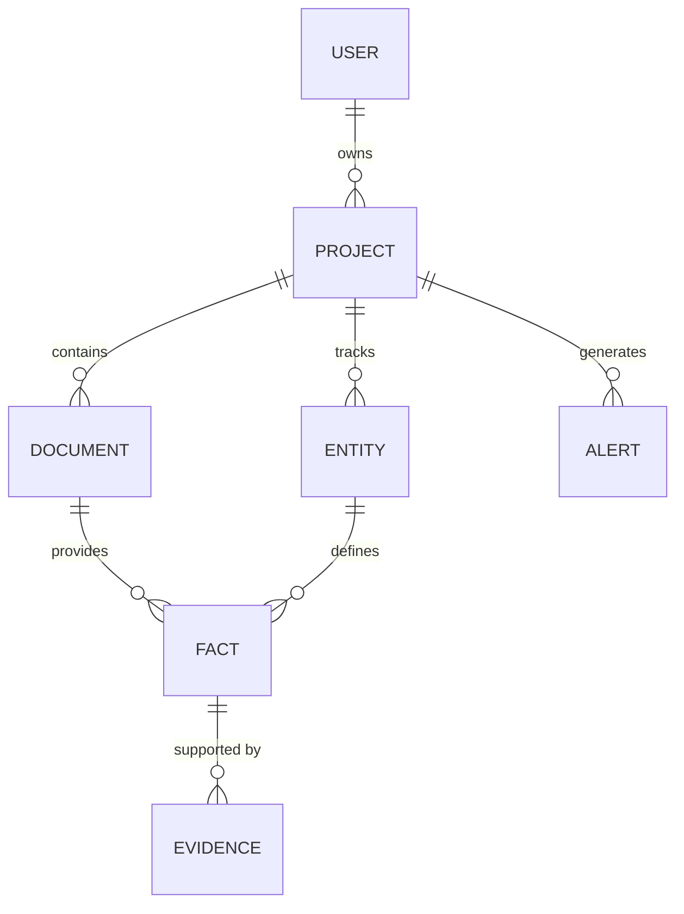

# Realm Sync PRD

## 1. Overview

**Realm Sync** is a canon-tracking web app for writers and Game Masters (GMs). It transforms narrative text into a structured, searchable knowledge base while proactively identifying continuity errors. By acting as an "archival engine," it ensures that character attributes, timelines, and world-building facts remain consistent across sprawling narratives.

- **Mascot**: Archivist Moth
- **AI Agent**: Vesper
- **Voice**: Calm, meticulous, evidence-oriented librarian. ("I found receipts.")

---

## 2. Problem Statement

As creative worlds grow, writers and GMs struggle with "canon drift":

- **Character Inconsistency**: Ages, eye colors, or abilities change without explanation.
- **Timeline Breaks**: Events occur in an impossible order or contradict established prerequisites.
- **Fact Drift**: Locations or items change properties inconsistently between chapters/sessions.
- **Forgotten Threads**: Unresolved plot points or character arcs get lost.
- **Manual Overhead**: Cross-referencing hundreds of pages of notes is slow and prone to human error.

---

## 3. Solution

Realm Sync provides a "canon engine" that automates the archival and verification process:

1. **Fact Extraction**: Automatically identifies entities and facts from raw text.
2. **Structured Canon**: Stores knowledge as verifiable triples (Subject-Predicate-Object).
3. **Verification**: Checks new content against the existing "source of truth."
4. **Evidence-Backed Alerts**: Flags contradictions with direct excerpts from previous documents.

---

## 4. Target Users

- **Indie Fiction Writers**: Authors of serials, web novels, and fanfiction.
- **TTRPG GMs**: Game Masters tracking complex campaign worlds and session histories.
- **Webcomic Creators**: Maintaining visual and narrative consistency.
- **Collaborative Writing Groups (Post-MVP)**: Ensuring multiple authors stay "in sync."

---

## 5. Core Principles

- **Evidence-First**: No fact or alert is valid without a supporting excerpt (the "receipt").
- **Incremental**: Canon compounds document by document; processing is additive, not destructive.
- **User-Controlled**: The AI proposes merges or updates; the human author makes the final call.
- **Low-Call Design**: Minimal LLM usage with aggressive caching to remain cost-effective.
- **Cozy Nook Aesthetic**: A dark, archival UI that feels like a quiet library rather than a sterile database.

---

## 6. MVP Features

### 6.1 Projects & Document Management

- **Project Isolation**: Manage multiple worlds/campaigns with separate canon.
- **Document Ingestion**: Paste raw text or upload files (`.txt`, `.md`).
- **In-App Editor**: Basic editor for drafting or tweaking documents.

### 6.2 Canon Extraction (Vesper Pipeline)

- **Entity Extraction**: Identify Characters, Locations, Items, Concepts, and Events.
- **Fact Extraction**: Extract triples with confidence scores and evidence snippets.
- **Temporal Metadata**: Associate facts with temporal bounds (e.g., "Event A happened before Event B").

### 6.3 Canon Browser

- **Entity View**: Detail pages for every entity showing attributes, relationships, and evidence.
- **Search**: Full-text search across the entire knowledge base.
- **Timeline**: A chronological view of extracted events.

### 6.4 Continuity Check

- **Contradiction Flagging**: Alerts for direct factual conflicts.
- **Timeline Verification**: Identifying "Time-Travel" errors (prerequisite violations).
- **Ambiguity Detection**: Flagging vague references that might lead to future errors.

### 6.5 Authentication

- **Convex Auth**: Two authentication methods:
  - Google OAuth (primary, frictionless sign-in)
  - Email + Password (fallback for users without Google)
- **Session Management**: Secure token-based sessions with automatic refresh.

---

## 7. Technical Stack

| Component         | Technology                               |
| :---------------- | :--------------------------------------- |
| **Framework**     | TanStack Start (React 19, SSR via Nitro) |
| **Runtime**       | pnpm                                     |
| **Backend**       | Convex (DB, Functions, Auth, Storage)    |
| **LLM**           | OpenRouter (`gpt-oss-120b:free`)         |
| **Styling**       | Tailwind v4 (CSS-first, OKLCH colors)    |
| **UI Components** | Shadcn / Base UI                         |
| **Monitoring**    | Sentry                                   |

---

## 8. Data Model (High-Level)

### Tables

- **Users**: Identity and preferences.
- **Projects**: The root of a specific canon.
- **Documents**: Raw text sources with metadata.
- **Entities**: Unique identifiers for characters, places, etc.
- **Facts**: Atomic pieces of knowledge (Triples).
- **Evidence**: Specific text excerpts linking Facts to Documents.
- **Alerts**: Continuity violations or suggested merges.

---

## 9. LLM Strategy (Vesper)

- **Model**: `gpt-oss-120b:free` via OpenRouter.
- **Structured Outputs**: Mandatory JSON Schema with `strict: true`.
- **Response Healing**: Auto-correction of malformed LLM responses.
- **Caching**: 7-day TTL based on `inputHash` + `promptVersion`.
- **Chunking**: Recursive character splitting for large documents to fit context windows.

---

## 10. User Flows

1. **Creation**: User creates a Project → Uploads first Document.
2. **Extraction**: Vesper processes text → Lists proposed Facts/Entities.
3. **Approval**: User confirms/edits proposed canon → Canon updated.
4. **Verification**: User uploads second Document → Vesper flags a contradiction with the first Document.
5. **Resolution**: User edits text or updates canon based on the Alert.

---

## 11. Vesper (Mascot) Integration

Vesper is not just a tool but an "Archivist Moth" that lives in the UI:

- **Notifications**: "I have found some discrepancies in the latest chapter."
- **Empty States**: Vesper waiting in a library nook for new texts.
- **Confidence**: Vesper displays confidence scores through subtle visual cues (e.g., wing flutter intensity).

---

## 12. Success Metrics

- **Efficiency**: >50% reduction in time spent on manual continuity checks.
- **Accuracy**: >80% of AI-extracted facts accepted by the user without edits.
- **Utility**: >70% of generated alerts resolved (fixed in text) rather than dismissed.
- **Retention**: >60% of users return to process a second document within 7 days.

---

## 13. Risks & Mitigations

- **LLM Hallucinations**: Mitigation through mandatory Evidence snippets and user confirmation steps.
- **Rate Limits**: Mitigation through aggressive caching, request queuing, and document chunking.
- **Model Volatility**: Mitigation through prompt versioning and fallback model support.

---

## 14. Implementation Phases

1. **Phase 1: Foundation**: Schema definition, Auth integration, basic CRUD for Projects/Documents. [See Foundation Specs](./PHASE-1-foundation.md)
2. **Phase 2: Extraction**: Implementation of the LLM pipeline and fact extraction UI. [See Extraction Pipeline Specs](./PHASE-2-extraction.md)
3. **Phase 3: Browser**: Entity detail pages, search, and relationship views.
4. **Phase 4: Continuity**: Development of the contradiction detection logic and Alert UI.
5. **Phase 5: Polish**: Mascot animations, UX refinement, and performance optimization.

---

## 15. Open Questions

- **Chunking**: What is the optimal chunk size for `gpt-oss-120b` to maintain context across facts?
- **Export**: Which formats are highest priority (Markdown, JSON, or CSV)?
