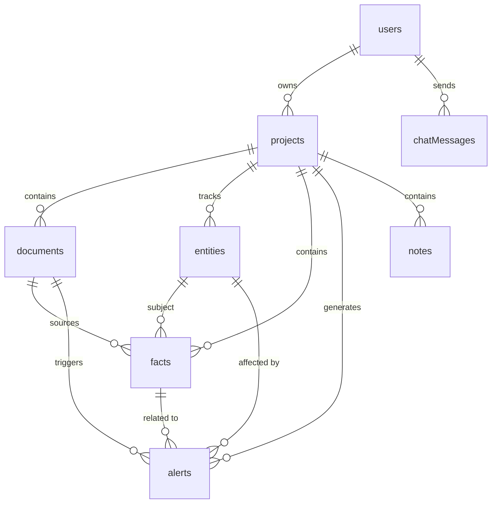

# Realm Sync Database Schema

This document provides a comprehensive reference for the Convex database schema used in the Realm Sync project. It serves as the source of truth for all table definitions, field types, and relationships.

## Overview

Realm Sync uses [Convex](https://www.convex.dev/) as its real-time backend. The schema is designed to support multi-user projects, automated canon extraction, and proactive continuity tracking.

## Entity Relationship Diagram

The following diagram illustrates the primary relationships between tables in the Realm Sync database.



---

## Tables

### `users`

Extended from Convex Auth. Stores user accounts and global preferences.

| Field | Type | Description |
| :-- | :-- | :-- |
| `name` | `v.optional(v.string())` | User's display name. |
| `email` | `v.optional(v.string())` | User's email address. |
| `emailVerificationTime` | `v.optional(v.float64())` | Verification timestamp. |
| `image` | `v.optional(v.string())` | URL to user's avatar. |
| `isAnonymous` | `v.optional(v.boolean())` | Guest user flag. |
| `createdAt` | `v.number()` | Account creation timestamp. |
| `onboardingCompleted` | `v.optional(v.boolean())` | Whether onboarding has been completed. |
| `tutorialState` | `v.optional(v.object({...}))` | Tour state (seen/completed steps/timestamps). |
| `settings` | `v.optional(v.object({...}))` | Theme and notification preferences. |

**Indexes:**

- `by_email`: `["email"]` (Unique lookup)

---

### `projects`

World or campaign containers. Each user can manage multiple isolated canons.

| Field | Type | Description |
| :-- | :-- | :-- |
| `userId` | `v.id("users")` | Reference to the owner. |
| `name` | `v.string()` | Name of the world or campaign. |
| `description` | `v.optional(v.string())` | Brief overview of the project. |
| `createdAt` | `v.number()` | Creation timestamp. |
| `updatedAt` | `v.number()` | Last modification timestamp. |
| `isTutorial` | `v.optional(v.boolean())` | Marks demo/tutorial projects. |
| `stats` | `v.optional(v.object({...}))` | Cached counts: `documentCount`, `noteCount`, `entityCount`, `factCount`, `alertCount`. |

**Indexes:**

- `by_user`: `["userId", "updatedAt"]` (Listing projects for a user)

---

### `documents`

Source text (chapters, session notes) belonging to a project.

| Field | Type | Description |
| :-- | :-- | :-- |
| `projectId` | `v.id("projects")` | Parent project reference. |
| `title` | `v.string()` | Title of the document. |
| `content` | `v.optional(v.string())` | Inline text content (limit: 1MB). |
| `storageId` | `v.id("_storage")` | Optional reference to Convex Storage for files >1MB. |
| `contentType` | `v.union(...)` | `"text"`, `"markdown"`, or `"file"`. |
| `orderIndex` | `v.number()` | Sequence within the project. |
| `wordCount` | `v.number()` | Total word count for the document. |
| `createdAt` | `v.number()` | Creation timestamp. |
| `updatedAt` | `v.number()` | Last edit timestamp. |
| `processedAt` | `v.optional(v.number())` | Timestamp of last extraction. |
| `processingStatus` | `v.union(...)` | `"pending"`, `"processing"`, `"completed"`, `"failed"`. |

**Indexes:**

- `by_project`: `["projectId", "orderIndex"]` (Ordered list)
- `by_project_status`: `["projectId", "processingStatus"]` (Filter for processing queue)

**Search Index:**

- `search_content`: `searchField: content`, `filterFields: [projectId]`

---

### `entities`

Canon objects (characters, locations, items, etc.) tracked across documents.

| Field | Type | Description |
| :-- | :-- | :-- |
| `projectId` | `v.id("projects")` | Project reference. |
| `name` | `v.string()` | Unique name within the project. |
| `type` | `v.union(...)` | `"character"`, `"location"`, `"item"`, `"concept"`, `"event"`. |
| `description` | `v.optional(v.string())` | Summary of the entity. |
| `aliases` | `v.array(v.string())` | Alternate names (e.g., nicknames, titles). |
| `firstMentionedIn` | `v.optional(v.id("documents"))` | Reference to the document where first discovered. |
| `status` | `v.union(...)` | `"pending"`, `"confirmed"`. |
| `createdAt` | `v.number()` | Creation timestamp. |
| `updatedAt` | `v.number()` | Last update timestamp. |

**Indexes:**

- `by_project`: `["projectId", "type"]` (List entities by type)
- `by_project_status`: `["projectId", "status"]` (Filter by status)
- `by_name`: `["projectId", "name"]` (Unique name lookup within project)

**Search Index:**

- `search_name`: `searchField: name`, `filterFields: [projectId]`

---

### `notes`

Free-form writing space for ideas, drafts, and collaborative brainstorming.

| Field | Type | Description |
| :-- | :-- | :-- |
| `projectId` | `v.id("projects")` | Parent project reference. |
| `title` | `v.string()` | Note title. |
| `content` | `v.string()` | Note content (rich text or markdown). |
| `contentType` | `v.union(...)` | `"text"`, `"markdown"`. |
| `tags` | `v.array(v.string())` | Optional tags for organization. |
| `pinned` | `v.boolean()` | Whether note is pinned to top. |
| `createdAt` | `v.number()` | Creation timestamp. |
| `updatedAt` | `v.number()` | Last edit timestamp. |

**Indexes:**

- `by_project`: `["projectId", "pinned", "updatedAt"]` (Ordered list with pinned first)

**Search Index:**

- `search_content`: `searchField: content`, `filterFields: [projectId]`

---

### `facts`

Atomic canon statements stored in Subject-Predicate-Object form.

| Field | Type | Description |
| :-- | :-- | :-- |
| `projectId` | `v.id("projects")` | Project reference. |
| `entityId` | `v.id("entities")` | Subject entity reference. |
| `documentId` | `v.id("documents")` | Source document reference. |
| `subject` | `v.string()` | The entity name or specific aspect. |
| `predicate` | `v.string()` | Relationship type or attribute (e.g., `"born_in"`). |
| `object` | `v.string()` | The value or target of the relationship. |
| `confidence` | `v.number()` | Extraction confidence score (0.0 to 1.0). |
| `evidenceSnippet` | `v.string()` | Direct quote from the document supporting this fact. |
| `evidencePosition` | `v.optional(v.object({...}))` | Start and end character offsets in the document. |
| `temporalBound` | `v.optional(v.object({...}))` | Time metadata (`type`: point/range/relative, `value`). |
| `status` | `v.union(...)` | `"pending"`, `"confirmed"`, `"rejected"`. |
| `createdAt` | `v.number()` | Extraction timestamp. |

**Indexes:**

- `by_entity`: `["entityId", "status"]` (Facts for an entity)
- `by_document`: `["documentId"]` (Facts extracted from a doc)
- `by_project`: `["projectId", "status"]` (All project facts)

---

### `alerts`

Continuity contradictions or ambiguities detected by Vellum.

| Field | Type | Description |
| :-- | :-- | :-- |
| `projectId` | `v.id("projects")` | Project reference. |
| `documentId` | `v.id("documents")` | Document that triggered the alert. |
| `factIds` | `v.array(v.id("facts"))` | References to conflicting facts. |
| `entityIds` | `v.array(v.id("entities"))` | Affected entities. |
| `type` | `v.union(...)` | `"contradiction"`, `"timeline"`, `"ambiguity"`. |
| `severity` | `v.union(...)` | `"error"`, `"warning"`. |
| `title` | `v.string()` | Short summary of the issue. |
| `description` | `v.string()` | Detailed explanation of the conflict. |
| `evidence` | `v.array(v.object({...}))` | List of `{ snippet, documentId, documentTitle }`. |
| `suggestedFix` | `v.optional(v.string())` | Potential resolution steps. |
| `status` | `v.union(...)` | `"open"`, `"resolved"`, `"dismissed"`. |
| `resolutionNotes` | `v.optional(v.string())` | Notes from the user on how it was handled. |
| `createdAt` | `v.number()` | Detection timestamp. |
| `resolvedAt` | `v.optional(v.number())` | Resolution timestamp. |

**Indexes:**

- `by_project`: `["projectId", "status"]` (Active alerts)
- `by_document`: `["documentId"]` (Alerts triggered by a doc)

---

### `llmCache`

Cache for LLM responses to optimize costs and performance.

| Field | Type | Description |
| :-- | :-- | :-- |
| `inputHash` | `v.string()` | SHA-256 hash of input text and prompt version. |
| `promptVersion` | `v.string()` | Version identifier for the extraction prompt. |
| `modelId` | `v.string()` | Identifier for the LLM used. |
| `response` | `v.string()` | Stringified JSON of the LLM response. |
| `tokenCount` | `v.optional(v.number())` | Estimated tokens used. |
| `createdAt` | `v.number()` | Cache entry timestamp. |
| `expiresAt` | `v.number()` | TTL expiration timestamp. |

**Indexes:**

- `by_hash`: `["inputHash", "promptVersion"]` (Cache lookup)

---

### `chatMessages`

Vellum AI chat message history for each user.

| Field       | Type            | Description                |
| :---------- | :-------------- | :------------------------- |
| `userId`    | `v.id("users")` | Reference to the user.     |
| `role`      | `v.union(...)`  | `"user"` or `"assistant"`. |
| `content`   | `v.string()`    | Message content.           |
| `createdAt` | `v.number()`    | Message timestamp.         |

**Indexes:**

- `by_user`: `["userId", "createdAt"]` (Ordered message history per user)

---

## Constraints & Limits

- **Document Size**: Document content stored in the `content` field is limited to **1MB**. For larger files, the `storageId` field is used to link to Convex Storage.
- **Fact Confidence**: Confidence scores should be between `0.0` and `1.0`.
- **Search Latency**: Full-text search on `documents.content` and `notes.content` is handled by Convex Search Indexes and may have a slight propagation delay (typically <1s).

## TypeScript Definitions

Convex automatically generates types based on the schema. Developers can use these types as follows:

```typescript
import { Doc, Id } from './_generated/dataModel';

// Table Document Types
export type User = Doc<'users'>;
export type Project = Doc<'projects'>;
export type Document = Doc<'documents'>;
export type Note = Doc<'notes'>;
export type Entity = Doc<'entities'>;
export type Fact = Doc<'facts'>;
export type Alert = Doc<'alerts'>;

// ID Types
export type ProjectId = Id<'projects'>;
export type DocumentId = Id<'documents'>;
export type NoteId = Id<'notes'>;
```

## Common Query Examples

### Fetching a Project's Canon

```typescript
const entities = await ctx.db
  .query('entities')
  .withIndex('by_project', (q) => q.eq('projectId', projectId))
  .collect();
```

### Fetching Project Notes

```typescript
const notes = await ctx.db
  .query('notes')
  .withIndex('by_project', (q) => q.eq('projectId', projectId))
  .collect();
```

### Searching Note Content

```typescript
const results = await ctx.db
  .query('notes')
  .withSearchIndex('search_content', (q) =>
    q.search('content', queryText).eq('projectId', projectId)
  )
  .collect();
```

### Searching Document Content

```typescript
const results = await ctx.db
  .query('documents')
  .withSearchIndex('search_content', (q) =>
    q.search('content', queryText).eq('projectId', projectId)
  )
  .collect();
```

### Checking LLM Cache

```typescript
const cached = await ctx.db
  .query('llmCache')
  .withIndex('by_hash', (q) =>
    q.eq('inputHash', hash).eq('promptVersion', version)
  )
  .first();
```
