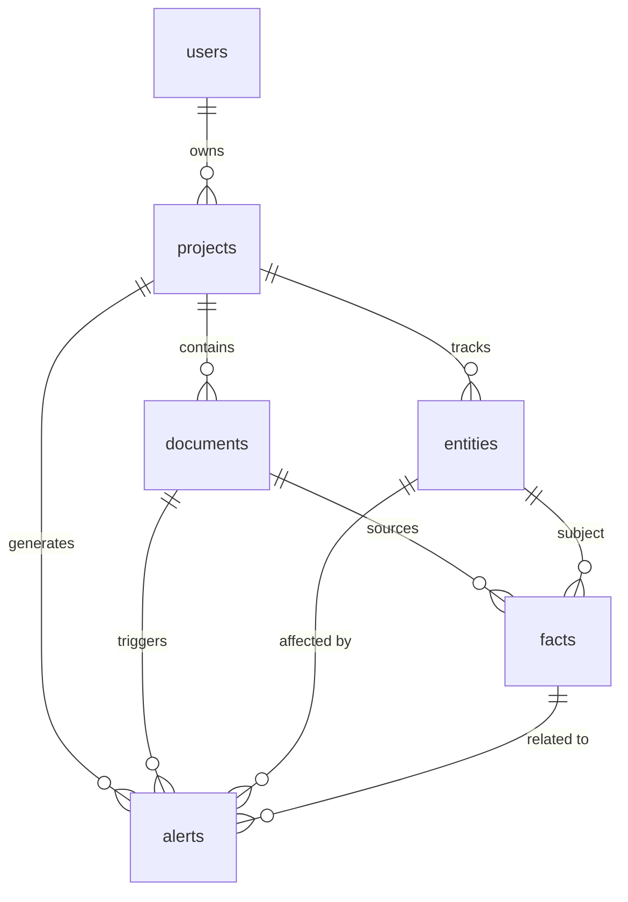

# Realm Sync - Technical Specification

## Executive Summary

**Realm Sync** is a canon-tracking web application for writers and Game Masters (GMs). It transforms narrative text into a structured, searchable knowledge base while proactively identifying continuity errors. The application uses a "Dark Archival" aesthetic with **Vesper, the Archivist Moth** as the AI mascot and continuity checker.

## Product Vision

### Problem

Creative worlds suffer from "canon drift":

- Character inconsistencies (age, eye color, abilities change without explanation)
- Timeline breaks (events occur in impossible order)
- Fact drift (locations/items change properties inconsistently)
- Forgotten threads (unresolved plot points)
- Manual cross-referencing is error-prone and time-consuming

### Solution

A "canon engine" that:

1. **Extracts**: Automatically identifies entities and facts from raw text using AI
2. **Structures**: Stores knowledge as verifiable triples (Subject-Predicate-Object)
3. **Verifies**: Checks new content against the existing "source of truth"
4. **Alerts**: Flags contradictions with direct evidence excerpts ("receipts")

### Target Users

- Indie Fiction Writers (serials, web novels, fanfiction)
- TTRPG Game Masters (campaign tracking)
- Webcomic Creators (visual and narrative consistency)
- Collaborative Writing Groups (post-MVP)

## Technical Stack

| Component | Technology | Notes |
| --- | --- | --- |
| **Framework** | TanStack Start (React 19) | SSR via Nitro |
| **Runtime** | pnpm | Exclusive package manager |
| **Backend** | Convex | DB, Functions, Auth, Storage |
| **LLM** | OpenRouter | `tngtech/deepseek-r1t2-chimera:free` (via Vesper) |
| **Styling** | Tailwind v4 | CSS-first, OKLCH colors |
| **UI Components** | Shadcn / Base UI | 13 primitives available |
| **Monitoring** | Sentry | Error tracking + instrumentation |
| **Fonts** | Fontsource | DM Sans, Aleo Variable, iA Writer Mono |

## Database Schema

### Entity Relationship Diagram



### Tables

#### `users`

Extended from Convex Auth.

- `name`: optional string
- `email`: string (unique)
- `image`: optional string
- `createdAt`: number
- `settings`: optional object (theme, notifications)

#### `projects`

World or campaign containers.

- `userId`: id("users")
- `name`: string
- `description`: optional string
- `createdAt`: number
- `updatedAt`: number
- `stats`: optional object (documentCount, entityCount, factCount, alertCount)

#### `documents`

Source text (chapters, session notes).

- `projectId`: id("projects")
- `title`: string
- `content`: optional string (≤1MB)
- `storageId`: optional id("\_storage") (for files >1MB)
- `contentType`: "text" | "markdown" | "file"
- `orderIndex`: number
- `wordCount`: number
- `createdAt`: number
- `updatedAt`: number
- `processedAt`: optional number
- `processingStatus`: "pending" | "processing" | "completed" | "failed"

#### `entities`

Canon objects (characters, locations, items, etc.).

- `projectId`: id("projects")
- `name`: string (unique within project)
- `type`: "character" | "location" | "item" | "concept" | "event"
- `description`: optional string
- `aliases`: array of strings
- `firstMentionedIn`: optional id("documents")
- `createdAt`: number
- `updatedAt`: number

#### `facts`

Atomic canon statements (Subject-Predicate-Object).

- `projectId`: id("projects")
- `entityId`: id("entities")
- `documentId`: id("documents")
- `subject`: string
- `predicate`: string (e.g., "has_eye_color")
- `object`: string
- `confidence`: number (0.0 to 1.0)
- `evidenceSnippet`: string
- `evidencePosition`: optional object { start, end }
- `temporalBound`: optional object { type, value }
- `status`: "pending" | "confirmed" | "rejected"
- `createdAt`: number

#### `alerts`

Continuity contradictions detected by Vesper.

- `projectId`: id("projects")
- `documentId`: id("documents")
- `factIds`: array of id("facts")
- `entityIds`: array of id("entities")
- `type`: "contradiction" | "timeline" | "ambiguity"
- `severity`: "error" | "warning"
- `title`: string
- `description`: string
- `evidence`: array of objects { snippet, documentId, documentTitle }
- `suggestedFix`: optional string
- `status`: "open" | "resolved" | "dismissed"
- `resolutionNotes`: optional string
- `createdAt`: number
- `resolvedAt`: optional number

#### `llmCache`

Cache for LLM responses to optimize costs.

- `inputHash`: string (SHA-256)
- `promptVersion`: string
- `modelId`: string
- `response`: string (stringified JSON)
- `tokenCount`: optional number
- `createdAt`: number
- `expiresAt`: number

---

## Implementation Phases

### Phase 1: Foundation

**Goal**: Establish data model, authentication, and basic CRUD. **Duration**: 1-2 weeks

**Deliverables**:

- Convex Schema implementation (all tables with proper indexes)
- Convex Auth integration (Google OAuth + Email/Password)
- Project Management CRUD (create, read, update, delete projects)
- Document Management CRUD (paste text, upload files, inline editor)
- File Storage integration (Convex Storage for >1MB files)
- Route structure established
- Dark Archival UI foundation (OKLCH tokens, typography)

**Convex Functions**:

- `projects.ts`: list, get, create, update, remove
- `documents.ts`: list, get, create, update, remove, reorder
- `storage.ts`: generateUploadUrl, getFileUrl

**Frontend Routes**:

```
src/routes/
├── __root.tsx           # Layout with auth check
├── index.tsx            # Dashboard
├── auth/
│   └── index.tsx        # Sign in/up
├── projects/
│   ├── index.tsx        # Project list
│   ├── new.tsx          # Create project
│   └── $projectId/
│       ├── index.tsx    # Project dashboard
│       └── documents/
│           ├── index.tsx      # Document list
│           ├── new.tsx        # Add document
│           └── $documentId.tsx # Editor
```

### Phase 2: Extraction

**Goal**: Build LLM-powered pipeline for entity/fact extraction. **Duration**: 1-2 weeks

**Deliverables**:

- OpenRouter integration in Convex actions
- Vesper extraction prompt (personality + structured output)
- Document chunking strategy (3,000 tokens, 200 token overlap)
- Extraction pipeline (action → validate → mutation)
- LLM response caching (7-day TTL)
- Extraction review UI (proposed entities/facts)
- Entity merging/aliasing

**Convex Functions**:

- `llm/extract.ts`: extractFromDocument (action), processExtractionResult (mutation)
- `llm/cache.ts`: checkCache, saveToCache, invalidateCache
- `entities.ts`: create, update, merge, listByProject, getWithFacts
- `facts.ts`: create, confirm, reject, listByEntity, listPending

**JSON Schema for Extraction**:

```typescript
{
  entities: [{
    name: string,
    type: "character" | "location" | "item" | "concept" | "event",
    description?: string,
    aliases?: string[]
  }],
  facts: [{
    entityName: string,
    subject: string,
    predicate: string,
    object: string,
    confidence: number,
    evidence: string,
    temporalBound?: { type, value }
  }],
  relationships: [{
    sourceEntity: string,
    targetEntity: string,
    relationshipType: string,
    evidence: string
  }]
}
```

### Phase 3: Browser

**Goal**: Build UI for exploring, searching, and managing canon. **Duration**: 1 week

**Deliverables**:

- Canon Browser main page with entity type filters
- Entity detail pages with facts and relationships
- Full-text search (Convex Search Index)
- Timeline view for events
- Entity editing capabilities

**Frontend Routes**:

```
src/routes/projects/$projectId/
├── canon/
│   ├── index.tsx           # Canon browser main
│   ├── search.tsx          # Search results
│   ├── entities/
│   │   └── $entityId.tsx   # Entity detail
│   └── timeline.tsx        # Timeline view
```

**UI Components**:

- CanonBrowser (main container)
- EntityTypeFilter (tabs with icons)
- EntityGrid (responsive grid)
- EntityCard (preview card)
- EntityHeader (name, type, edit dropdown)
- AttributeList (facts as structured cards)
- RelationshipGraph (node-link visualization)
- AppearanceTimeline (chronological list)
- EvidencePanel (collapsible source quotes)

### Phase 4: Continuity

**Goal**: Build system for detecting contradictions and timeline errors. **Duration**: 1-2 weeks

**Deliverables**:

- Continuity check prompts (Vesper persona)
- Check pipeline (gather canon → LLM analysis → alerts)
- Alert types: contradictions, timeline issues, ambiguities
- Alerts Dashboard UI
- Alert resolution workflow (resolve, dismiss, update canon)
- Auto-check on document save

**Alert Types**:

- **Contradiction**: Two facts about same entity that directly conflict (e.g., eye color change)
- **Timeline Issue**: Events occurring in impossible order (e.g., character dead but appears later)
- **Ambiguity**: Unclear references, alias collisions (e.g., two "Captains" without clarification)

**Convex Functions**:

- `checks.ts`: runCheck (action), createAlerts (mutation)
- `alerts.ts`: listByProject, listByDocument, resolve

**JSON Schema for Check**:

```typescript
{
  alerts: [{
    type: "contradiction" | "timeline" | "ambiguity",
    severity: "error" | "warning",
    title: string,
    description: string,
    evidence: [{ source: "canon" | "new_document", quote: string }],
    suggestedFix?: string,
    affectedEntities: string[]
  }],
  summary: {
    totalIssues: number,
    errors: number,
    warnings: number,
    checkedEntities: string[]
  }
}
```

### Phase 5: Polish

**Goal**: Refine UX, integrate Vesper mascot, add quality-of-life features. **Duration**: Ongoing

**Deliverables**:

- Full Vesper mascot integration (visual + voice)
- Meaningful animations (staggered reveals, micro-interactions)
- Guided onboarding flow
- Keyboard shortcuts (`Cmd+K` for search, `Cmd+S` to save, etc.)
- Export functionality (JSON, Markdown, CSV)
- Performance optimization (indexing, pagination)
- Post-MVP groundwork (Relationship Maps, Collaboration)

**Keyboard Shortcuts**: | Shortcut | Action | |----------|--------| | `Cmd/Ctrl + K` | Open Command Palette / Search | | `Cmd/Ctrl + N` | Create new document | | `Cmd/Ctrl + E` | Trigger extraction | | `Cmd/Ctrl + S` | Save document | | `Escape` | Close editor / Cancel | | `J / K` | Navigate up/down in lists | | `/` | Focus search input |

---

## Design System

### Aesthetic: Dark Archival / Cozy Nook

**Theme**: Warm, inviting darkness, candlelit study, aged parchment.

### Color Palette (OKLCH)

**Base Colors**:

- `--background`: oklch(0.13 0.015 70) — Deep warm black
- `--foreground`: oklch(0.88 0.02 75) — Warm off-white
- `--card`: oklch(0.16 0.015 70) — Raised study surface
- `--primary`: oklch(0.7 0.06 70) — Moth-wing Amber
- `--secondary`: oklch(0.25 0.03 70) — Dusty Archive
- `--accent`: oklch(0.28 0.04 70) — Candlelight Glow

**Semantic Colors**:

- `--destructive`: oklch(0.55 0.2 25) — Aged Red Ink
- `--success`: oklch(0.55 0.15 145) — Aged Green Ink
- `--warning`: oklch(0.65 0.15 85) — Amber Warning

**Entity Type Colors**:

- `--entity-character`: oklch(0.65 0.15 25) — Warm Red
- `--entity-location`: oklch(0.6 0.12 145) — Forest Green
- `--entity-item`: oklch(0.7 0.15 75) — Amber Gold
- `--entity-concept`: oklch(0.6 0.18 280) — Dusty Purple
- `--entity-event`: oklch(0.65 0.12 220) — Slate Blue

### Typography

- **Headings**: 'Aleo Variable', serif (200-900)
- **Body**: 'DM Sans Variable', sans-serif
- **Mono**: 'iA Writer Mono', monospace

### Visual Textures

- **Paper Grain**: SVG noise overlay (3% opacity)
- **Vignette**: Inset box-shadow for depth
- **Aged Borders**: Double-border effect with gold/sepia tones

### Icons (Lucide React)

| Entity    | Icon      | Action  | Icon     |
| --------- | --------- | ------- | -------- |
| Character | User      | Search  | Search   |
| Location  | MapPin    | Extract | Sparkles |
| Item      | Package   | Check   | Shield   |
| Concept   | Lightbulb | Add     | Plus     |
| Event     | Calendar  | Edit    | Pencil   |
| —         | —         | Delete  | Trash2   |

---

## Current State Analysis

### What Exists (Functional)

- ✅ TanStack Start + React 19 routing infrastructure
- ✅ Convex integration with provider (`src/integrations/convex/provider.tsx`)
- ✅ 13 Shadcn UI primitives (`src/components/ui/`)
- ✅ Tailwind v4 with OKLCH design tokens (`src/styles.css`)
- ✅ Base layout with Header (`src/routes/__root.tsx`)

### What Exists (Placeholder/Demo)

- ❌ `convex/schema.ts` — Only contains `todos` and `products` (example tables)
- ❌ `convex/todos.ts` — Standard CRUD example (delete in Phase 1)
- ❌ `src/routes/index.tsx` — Renders `<ComponentExample />` (placeholder)
- ❌ `src/routes/demo.theme.tsx` — Design system showcase (delete after Phase 1)
- ❌ `src/components/component-example.tsx` — Demo component grid (delete after Phase 1)

### What's Missing

- ❌ Auth implementation (Convex Auth: Google OAuth + Email/Password)
- ❌ Real schema (`users`, `projects`, `documents`, `entities`, `facts`, `alerts`, `llmCache`)
- ❌ Project/Document CRUD functions
- ❌ LLM integration (OpenRouter, Vesper extraction prompts)
- ❌ Canon Browser routes and components
- ❌ Continuity checking system
- ❌ Vesper mascot integration

---

## Testing Strategy

### Test Pyramid

```
        /\
       /E2E\      ← 10% (Deferred until MVP+)
      /─────\
     /Int'gr\    ← 30% (Component + Convex integration)
    /───────\
   /  Unit  \   ← 60% (Utilities, Convex functions, logic)
  /───────────\
```

### Coverage Target

- **Unit Tests**: 60% (Convex functions, utilities)
- **Integration Tests**: 30% (UI components, Convex bridge)
- **Overall**: 80% (Unit + Integration)

### Configuration

- **Test Runner**: Vitest
- **Environment**: edge-runtime
- **Convex Testing**: `convex-test` package
- **Component Testing**: `@testing-library/react`

### Key Patterns

- Test **behavior**, not implementation details
- Use `convex-test` for Convex functions
- Mock Convex queries in React component tests
- Case-insensitive error message matching
- Check ID existence, not format

---

## Environment Variables

### Server

```env
CONVEX_DEPLOYMENT=...
OPENROUTER_API_KEY=...
SENTRY_DSN=...
```

### Client

```env
VITE_CONVEX_URL=...
VITE_SENTRY_DSN=...
```

---

## Commands

### Development

```bash
pnpm dev              # Start dev server with instrumentation
```

### Build & Production

```bash
pnpm run build         # Build for production
pnpm run start         # Start production server
```

### Testing

```bash
pnpm test              # Run all tests
pnpm run test:coverage # Run with coverage report
```

### Formatting & Linting

```bash
pnpm run format        # Prettier
pnpm run lint         # Oxlint
```

### Documentation

```bash
pnpm docs:list         # List all docs
```

---

## Success Metrics

- **Efficiency**: >50% reduction in time spent on manual continuity checks
- **Accuracy**: >80% of AI-extracted facts accepted by user without edits
- **Utility**: >70% of generated alerts resolved (fixed in text) rather than dismissed
- **Retention**: >60% of users return to process a second document within 7 days

---

## Risks & Mitigations

| Risk | Mitigation |
| --- | --- |
| **LLM Hallucinations** | Mandatory evidence snippets, user confirmation steps |
| **Rate Limits** | Aggressive caching (7-day TTL), request queuing, document chunking |
| **Model Volatility** | Prompt versioning, fallback model support |
| **Token Costs** | `tngtech/deepseek-r1t2-chimera:free` (free tier), caching, chunking optimization |

---

## Open Questions

1. **Chunking**: What is optimal chunk size for `gpt-oss-120b` to maintain context across facts? (Current target: ~3,000 tokens)
2. **Export**: Which formats are highest priority (Markdown, JSON, or CSV)?
3. **Collaboration**: Should Phase 5 include real-time collaboration via Convex subscriptions, or focus on export/import first?

---

## Resources

### Documentation

- [TanStack Start Docs](https://tanstack.com/start/latest)
- [Convex Docs](https://docs.convex.dev/)
- [OpenRouter API](https://openrouter.ai/docs)
- [Tailwind v4](https://tailwindcss.com/)

### Internal Docs

- `docs/PRD.md` — Product Requirements
- `docs/SCHEMA.md` — Detailed Database Schema
- `docs/UI-DESIGN.md` — Visual Design System
- `docs/TESTING-STRATEGY.md` — Testing Approach
- `docs/PHASE-*.md` — Implementation Phase Details

---

_Last Updated: January 2, 2026_
